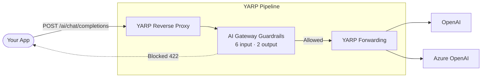
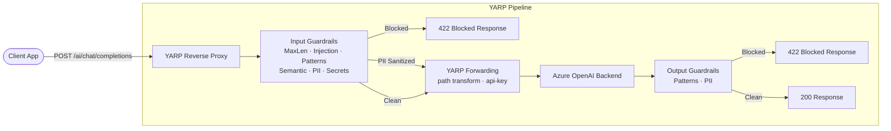
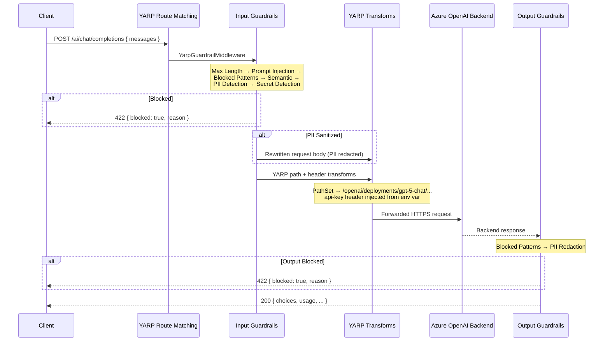
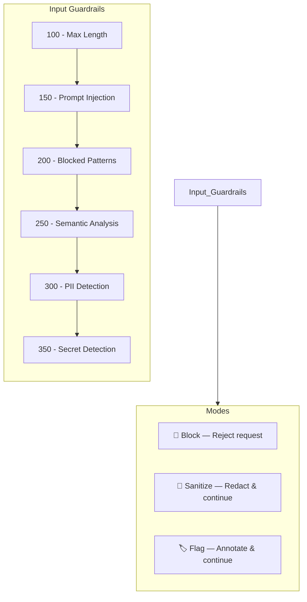
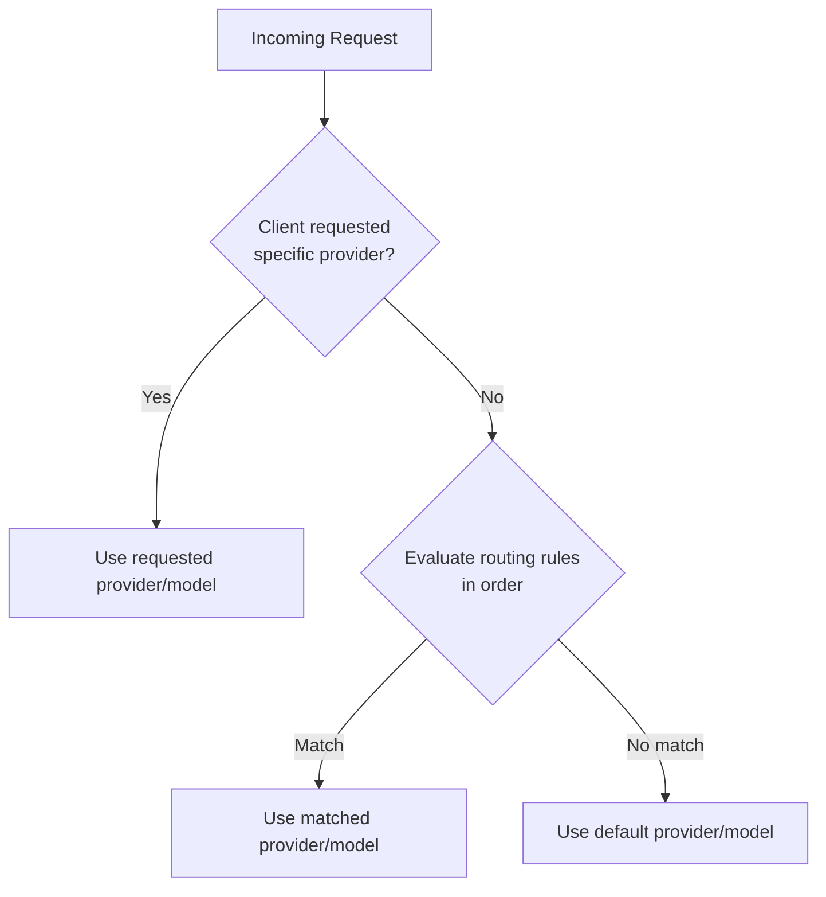
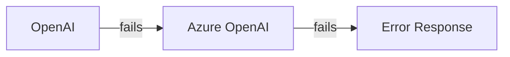
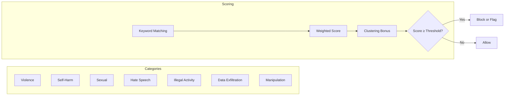
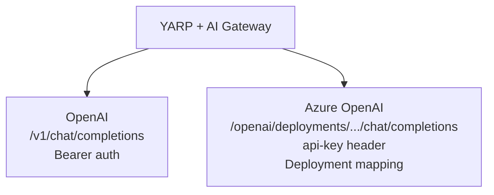

# Yarp.AiGateway

An **AI Gateway** built as an extension of [YARP (Yet Another Reverse Proxy)](https://github.com/microsoft/reverse-proxy) for .NET 10. It plugs into a standard YARP reverse proxy and adds AI-specific guardrails, intelligent routing, PII redaction, prompt injection detection, rate limiting, and audit logging — all configured with a single JSON file.

[](https://dotnet.microsoft.com)
[](https://github.com/microsoft/reverse-proxy)
[](LICENSE)

---

## TL;DR

> **YARP handles the reverse proxy. AI Gateway sits inside the YARP pipeline adding safety.**

```csharp
// YARP reverse proxy — routes, clusters, transforms from config
builder.Services.AddReverseProxy()
    .LoadFromConfig(builder.Configuration.GetSection("ReverseProxy"))
    .AddTransforms(context =>
    {
        context.AddRequestTransform(tc =>
        {
            var apiKey = Environment.GetEnvironmentVariable("AZURE_OPENAI_API_KEY") ?? "";
            tc.ProxyRequest.Headers.TryAddWithoutValidation("api-key", apiKey);
            return ValueTask.CompletedTask;
        });
    });

// AI Gateway guardrails — PII, injection, patterns, secrets, audit
builder.Services.AddAiGatewayFromJson("aigateway.json");

var app = builder.Build();

// Guardrails sit INSIDE the YARP pipeline — every proxied request
// is inspected before YARP forwards it to the backend.
app.MapReverseProxy(proxyPipeline =>
{
    proxyPipeline.UseAiGatewayGuardrails();
});
app.Run();
```

| What you get | How |
|---|---|
| **Multi-provider routing** (OpenAI, Azure OpenAI) | Declarative rules in `aigateway.json` |
| **Automatic fallback** between providers | `"fallbacks": [{ "from": "openai", "to": "azure-openai" }]` |
| **PII redaction** (emails, SSN, credit cards, DNI, IBAN...) | `{ "type": "pii", "mode": "sanitize" }` |
| **Prompt injection detection** (30+ patterns + structural) | Always enabled by default |
| **Semantic content analysis** (violence, hate, self-harm...) | `{ "type": "semantic", "mode": "block" }` |
| **Secret leak prevention** (API keys, JWTs, connection strings) | `{ "type": "secret-detection", "mode": "block" }` |
| **Rate limiting** per user/tenant/app | `{ "requestsPerMinute": 60, "scope": "user" }` |
| **Audit logging** with latency, tokens, and cost | Built-in, extensible via `IAuditSink` |



---

## Table of Contents

- [Yarp.AiGateway](#yarpaigateway)
  - [TL;DR](#tldr)
  - [Table of Contents](#table-of-contents)
  - [Architecture](#architecture)
    - [High-Level Flow](#high-level-flow)
    - [Request Lifecycle](#request-lifecycle)
    - [Guardrail Pipeline](#guardrail-pipeline)
  - [How It Extends YARP](#how-it-extends-yarp)
  - [Features](#features)
  - [Project Structure](#project-structure)
  - [Quick Start](#quick-start)
    - [1. Add the NuGet references](#1-add-the-nuget-references)
    - [2. Configure YARP routes in `appsettings.json`](#2-configure-yarp-routes-in-appsettingsjson)
    - [3. Create `aigateway.json`](#3-create-aigatewayjson)
    - [4. Wire it up in `Program.cs`](#4-wire-it-up-in-programcs)
    - [5. Send requests](#5-send-requests)
    - [Response](#response)
  - [Full Flow Demo](#full-flow-demo)
    - [The "Weather + Football" Scenario](#the-weather--football-scenario)
  - [Configuration Reference](#configuration-reference)
    - [Gateway](#gateway)
    - [Providers](#providers)
    - [Routing](#routing)
      - [Conditions](#conditions)
      - [Available Fields](#available-fields)
      - [Fallbacks](#fallbacks)
    - [Guardrails](#guardrails)
    - [Quotas](#quotas)
    - [Telemetry](#telemetry)
  - [Guardrails Deep Dive](#guardrails-deep-dive)
    - [Input Guardrails](#input-guardrails)
      - [Prompt Injection Detection (Order 150)](#prompt-injection-detection-order-150)
      - [Semantic Content Analysis (Order 250)](#semantic-content-analysis-order-250)
      - [PII Detection \& Redaction (Order 300)](#pii-detection--redaction-order-300)
      - [Secret Detection (Order 350)](#secret-detection-order-350)
      - [Max Length (Order 100)](#max-length-order-100)
      - [Blocked Patterns (Order 200)](#blocked-patterns-order-200)
    - [Output Guardrails](#output-guardrails)
  - [Supported Providers](#supported-providers)
  - [Extensibility](#extensibility)
    - [Custom Guardrail](#custom-guardrail)
    - [Custom Provider](#custom-provider)
    - [Custom Audit Sink](#custom-audit-sink)
  - [Testing](#testing)
    - [Test Coverage](#test-coverage)
  - [Roadmap](#roadmap)
  - [Requirements](#requirements)
  - [License](#license)

---

## Architecture

### High-Level Flow



### Request Lifecycle



### Guardrail Pipeline



---

## How It Extends YARP

[YARP (Yet Another Reverse Proxy)](https://github.com/microsoft/reverse-proxy) is Microsoft's open-source reverse proxy for .NET. It handles routing, load balancing, transforms, and health checks for any HTTP traffic through `AddReverseProxy()` and `MapReverseProxy()`.

**Yarp.AiGateway** doesn't replace YARP — it **sits inside the YARP pipeline**. YARP handles routing, transforms, and forwarding. The AI Gateway adds guardrails that inspect every request and response flowing through the proxy.

```
┌───────────────────────────────────────────────────────────────────────┐
│                         YARP Reverse Proxy                           │
│                                                                       │
│  Client ──► Route Match ──► AI Gateway Guardrails ──► Forwarding ──► │
│                              │                         │              │
│                              │ Input:                  │ Transforms:  │
│                              │  • Max Length            │  • PathSet   │
│                              │  • Prompt Injection      │  • api-key   │
│                              │  • Blocked Patterns      │  • api-ver   │
│                              │  • Semantic Analysis     │              │
│                              │  • PII Redaction         │              │
│                              │  • Secret Detection      │              │
│                              │                         ▼              │
│                              │ Output:            Azure OpenAI       │
│                              │  • Blocked Patterns     Backend        │
│                              │  • PII Redaction                       │
│                              │                                        │
│                              ▼                                        │
│                         422 if blocked                                │
└───────────────────────────────────────────────────────────────────────┘
```

| Aspect | YARP | AI Gateway (inside YARP pipeline) |
|--------|------|-----------------------------------|
| **Config** | `appsettings.json` → Routes, Clusters, Transforms | `aigateway.json` → Guardrails |
| **Registration** | `AddReverseProxy().LoadFromConfig()` | `AddAiGatewayFromJson()` |
| **Pipeline** | `MapReverseProxy(proxyPipeline => ...)` | `proxyPipeline.UseAiGatewayGuardrails()` |
| **Routing** | YARP routes match paths to backend clusters | YARP handles all routing |
| **Auth** | `AddTransforms()` → inject api-key header | N/A (YARP transforms handle it) |
| **Safety** | None (raw proxy) | 6 input + 2 output guardrails |
| **Request format** | Standard OpenAI chat format | Transparent (inspects then passes through) |

---

## Features

| Category | Capabilities |
|----------|-------------|
| **Multi-Provider Routing** | OpenAI, Azure OpenAI — with automatic fallback chains |
| **Declarative Config** | Single `aigateway.json` file with environment variable resolution (`env:VAR_NAME`) |
| **Input Guardrails** | Prompt injection detection, PII redaction, semantic content analysis, secret detection, length limits, blocked patterns |
| **Output Guardrails** | Response PII redaction, blocked pattern filtering |
| **Rate Limiting** | Per-user / per-tenant / per-application quotas (RPM and token-based) |
| **Intelligent Routing** | Condition-based rules (prompt length, tenant, metadata fields) with 9 operators |
| **Audit & Telemetry** | Structured logging of every request with latency, tokens, cost, and flags |
| **Extensibility** | Plug in custom guardrails, providers, routers, and audit sinks via DI |

---

## Project Structure

```
Yarp.AiGateway.slnx
│
├── src/
│   ├── Yarp.AiGateway.Abstractions/     # Interfaces & models (zero dependencies)
│   │   ├── IAiProvider.cs
│   │   ├── IAiGatewayPipeline.cs
│   │   ├── IInputGuardrail.cs
│   │   ├── IOutputGuardrail.cs
│   │   ├── IModelRouter.cs
│   │   ├── IQuotaManager.cs
│   │   ├── IAuditSink.cs
│   │   ├── IPolicyEvaluator.cs
│   │   ├── IProviderFactory.cs
│   │   └── Models/
│   │       ├── AiGatewayRequest.cs       # Provider-agnostic request
│   │       ├── AiGatewayResponse.cs      # Normalized response
│   │       ├── GuardrailDecisions.cs     # Allow/Block decisions
│   │       ├── RouteDecision.cs          # Routing result
│   │       ├── PolicyContext.cs
│   │       └── AuditEvent.cs
│   │
│   ├── Yarp.AiGateway.Core/             # Pipeline, routing, middleware
│   │   ├── Middleware/
│   │   │   ├── AiGatewayMiddleware.cs    # Standalone mode (calls providers directly)
│   │   │   └── YarpGuardrailMiddleware.cs # YARP pipeline mode (guardrails only)
│   │   ├── Pipeline/
│   │   │   ├── AiGatewayPipeline.cs      # Orchestrates the full flow
│   │   │   └── DefaultPolicyEvaluator.cs
│   │   ├── Routing/
│   │   │   ├── DefaultModelRouter.cs     # Rule-based model routing
│   │   │   └── ConditionEvaluator.cs     # Typed condition engine
│   │   ├── Configuration/
│   │   │   ├── AiGatewayConfiguration.cs # Config model classes
│   │   │   ├── AiGatewayConfigLoader.cs  # JSON loader + env var resolution
│   │   │   └── AiGatewayConfigValidator.cs
│   │   ├── Quotas/
│   │   │   └── InMemoryQuotaManager.cs   # Sliding-window rate limiter
│   │   ├── Providers/
│   │   │   └── DefaultProviderFactory.cs
│   │   ├── Telemetry/
│   │   │   └── DefaultAuditSink.cs       # ILogger-based audit
│   │   └── Extensions/
│   │       ├── AiGatewayServiceCollectionExtensions.cs
│   │       ├── GuardrailRegistrationExtensions.cs
│   │       └── ProviderRegistrationExtensions.cs
│   │
│   ├── Yarp.AiGateway.Guardrails/        # All guardrail implementations
│   │   ├── Input/
│   │   │   ├── MaxLengthGuardrail.cs
│   │   │   ├── PromptInjectionGuardrail.cs
│   │   │   ├── BlockedPatternsGuardrail.cs
│   │   │   ├── SemanticGuardrail.cs      # Weighted keyword scoring
│   │   │   ├── PiiDetectionGuardrail.cs  # Regex-based PII detection
│   │   │   └── SecretDetectionGuardrail.cs
│   │   └── Output/
│   │       ├── BlockedPatternsOutputGuardrail.cs
│   │       └── PiiOutputGuardrail.cs
│   │
│   ├── Yarp.AiGateway.Providers.OpenAI/
│   └── Yarp.AiGateway.Providers.AzureOpenAI/
│
├── samples/
│   ├── Sample.MinimalApi/                # Minimal single-route AI sample
│   │   ├── Program.cs                    # YARP + AI Gateway guardrails wiring
│   │   ├── aigateway.json                # AI Gateway config (guardrails)
│   │   ├── appsettings.json              # YARP config (routes, clusters, transforms)
│   │   └── Sample.MinimalApi.http        # 14 ready-to-run test requests
│   │
│   └── Sample.FullFlow/                  # Full-flow demo: YARP → microservices + AI
│       ├── Program.cs                    # 3 apps in 1: Weather µService, Catalog µService, YARP Gateway
│       ├── aigateway.json                # AI Gateway guardrails config
│       ├── appsettings.json              # 3 YARP routes × 3 clusters (weather, catalog, AI)
│       └── Sample.FullFlow.http          # 23 test requests across all backends
│
└── tests/
    ├── Yarp.AiGateway.Core.Tests/
    ├── Yarp.AiGateway.Guardrails.Tests/
    └── Yarp.AiGateway.IntegrationTests/  # 24 end-to-end tests vs Azure OpenAI
```

---

## Quick Start

### 1. Add the NuGet references

```xml
<PackageReference Include="Yarp.ReverseProxy" Version="2.3.0" />
<ProjectReference Include="Yarp.AiGateway.Core" />
```

### 2. Configure YARP routes in `appsettings.json`

YARP defines which backends to proxy to and how to transform requests:

```json
{
  "ReverseProxy": {
    "Routes": {
      "ai-chat": {
        "ClusterId": "azure-openai",
        "Match": {
          "Path": "/ai/chat/completions",
          "Methods": [ "POST" ]
        },
        "Transforms": [
          { "PathSet": "/openai/deployments/gpt-4o/chat/completions" },
          { "QueryValueParameter": "api-version", "Set": "2025-01-01-preview" }
        ]
      }
    },
    "Clusters": {
      "azure-openai": {
        "Destinations": {
          "primary": { "Address": "https://my-openai.openai.azure.com/" }
        }
      }
    }
  }
}
```

### 3. Create `aigateway.json`

```json
{
  "gateway": {
    "endpoint": "/ai/chat",
    "timeoutSeconds": 60
  },
  "providers": {
    "azure-openai": {
      "type": "azure-openai",
      "endpoint": "env:AZURE_OPENAI_ENDPOINT",
      "apiKey": "env:AZURE_OPENAI_API_KEY",
      "defaultModel": "gpt-4o",
      "deploymentMap": {
        "gpt-4o": "my-gpt4o-deployment"
      }
    }
  },
  "routing": {
    "defaultProvider": "azure-openai",
    "defaultModel": "gpt-4o",
    "rules": [
      { "name": "default", "provider": "azure-openai", "model": "gpt-4o", "conditions": [] }
    ]
  },
  "guardrails": {
    "input": [
      { "type": "max-length", "mode": "block", "parameters": { "maxLength": 32000 } },
      { "type": "prompt-injection", "mode": "block", "parameters": {} },
      { "type": "pii", "mode": "sanitize", "parameters": { "detectEmails": true, "detectCreditCards": true } },
      { "type": "secret-detection", "mode": "block", "parameters": {} },
      {
        "type": "blocked-patterns",
        "mode": "block",
        "parameters": {
          "patterns": [
            "DROP TABLE", "DELETE FROM", "TRUNCATE TABLE", "UNION SELECT",
            "xp_cmdshell", "<script>", "<iframe>", "javascript:", "eval(",
            "politics", "football", "Champions League"
          ]
        }
      }
    ],
    "output": [
      {
        "type": "blocked-patterns",
        "mode": "block",
        "parameters": {
          "patterns": [
            "internal server error", "stack trace:", "password=",
            "BEGIN RSA PRIVATE KEY", "AccountKey=", "sk-proj-"
          ]
        }
      },
      { "type": "pii", "mode": "sanitize", "parameters": {} }
    ]
  }
}
```

### 4. Wire it up in `Program.cs`

```csharp
using Yarp.AiGateway.Core.Extensions;

var builder = WebApplication.CreateBuilder(args);

// YARP reverse proxy — routes, clusters, transforms from config
builder.Services.AddReverseProxy()
    .LoadFromConfig(builder.Configuration.GetSection("ReverseProxy"))
    .AddTransforms(context =>
    {
        // Inject API key from env var into proxied requests
        context.AddRequestTransform(tc =>
        {
            var apiKey = Environment.GetEnvironmentVariable("AZURE_OPENAI_API_KEY") ?? "";
            tc.ProxyRequest.Headers.TryAddWithoutValidation("api-key", apiKey);
            return ValueTask.CompletedTask;
        });
    });

// AI Gateway — guardrails from aigateway.json
builder.Services.AddAiGatewayFromJson("aigateway.json");

var app = builder.Build();

// Guardrails sit inside the YARP pipeline — inspect, then forward
app.MapReverseProxy(proxyPipeline =>
{
    proxyPipeline.UseAiGatewayGuardrails();
});

app.Run();
```

### 5. Send requests

Clients use the **standard OpenAI chat format** — the AI Gateway is transparent:

```bash
# Request goes through YARP → guardrails → Azure OpenAI
curl -X POST http://localhost:5038/ai/chat/completions \
  -H "Content-Type: application/json" \
  -d '{
    "messages": [
      { "role": "user", "content": "What is quantum computing?" }
    ],
    "max_tokens": 200
  }'
```

### Response

The response is the **native Azure OpenAI response** — no wrapper format:

```json
{
  "id": "chatcmpl-abc123",
  "object": "chat.completion",
  "model": "gpt-4o",
  "choices": [
    {
      "index": 0,
      "message": {
        "role": "assistant",
        "content": "Quantum computing is..."
      },
      "finish_reason": "stop"
    }
  ],
  "usage": {
    "prompt_tokens": 12,
    "completion_tokens": 150,
    "total_tokens": 162
  }
}
```

If blocked by guardrails, the response is `422 Unprocessable Entity`:

```json
{
  "blocked": true,
  "blockReason": "Prompt injection detected: DAN jailbreak attempt"
}
```

---

## Full Flow Demo

The **Sample.FullFlow** project runs three apps in a single process to demonstrate how YARP routes requests to different backends — and how guardrails selectively block AI requests based on topic policies.

```bash
# Set your Azure OpenAI key and run
export AZURE_OPENAI_API_KEY="your-key"
dotnet run --project samples/Sample.FullFlow
```

**Architecture:**

```
Client → YARP Gateway (:5050)
  ├─ /api/weather/*       → Weather µService (:5100)   [no guardrails]
  ├─ /api/catalog/*       → Catalog µService (:5200)   [no guardrails]
  └─ /ai/chat/completions → [Guardrails] → Azure OpenAI
```

### The "Weather + Football" Scenario

This scenario proves the gateway policy: **we serve weather data, but we do NOT provide weather-based football analysis through our AI endpoint.**

| Step | Request | Topic | Result |
|------|---------|-------|--------|
| **1** | `GET /api/weather/Madrid` | Raw weather data | ✅ `200` — Returns `{"city":"Madrid","tempC":28,"condition":"Sunny"}` |
| **2** | `POST /ai/chat/completions` — _"Madrid is 28°C. How would a football match go for players from Siberia?"_ | Weather + **Football** | 🚫 `422` — `{"blocked":true,"blockReason":"Prompt blocked: matches forbidden pattern."}` |
| **3** | `POST /ai/chat/completions` — _"Madrid is 28°C. Good for outdoor construction?"_ | Weather + Construction | ✅ `200` — AI responds normally |
| **4** | `POST /ai/chat/completions` — _"Madrid is 28°C. Conference attendees from Siberia — clothing tips?"_ | Weather + Siberians + **Conference** | ✅ `200` — AI responds with detailed recommendations |

**Key takeaway:** Steps 2 and 4 use the **same weather data** and the **same people from Siberia**. The only difference is the purpose — football is blocked, conference passes. The guardrail pattern fires inside the YARP pipeline before the request ever reaches Azure OpenAI.

All 26 test requests are in [`Sample.FullFlow.http`](samples/Sample.FullFlow/Sample.FullFlow.http).

---

## Configuration Reference

### Gateway

| Property | Type | Default | Description |
|----------|------|---------|-------------|
| `endpoint` | string | `/ai/chat` | HTTP path the middleware intercepts |
| `timeoutSeconds` | int | `60` | Request timeout |
| `includePromptInAudit` | bool | `false` | Store prompts in audit events |
| `defaultOperation` | string | `chat` | Default operation type |

### Providers

```json
{
  "providers": {
    "azure-openai": {
      "type": "azure-openai",
      "endpoint": "env:AZURE_OPENAI_ENDPOINT",
      "apiKey": "env:AZURE_OPENAI_API_KEY",
      "apiVersion": "2025-01-01-preview",
      "deploymentMap": {
        "gpt-4o": "my-gpt4o-deployment",
        "gpt-4o-mini": "my-gpt4omini-deployment"
      },
      "enabled": true,
      "priority": 1
    }
  }
}
```

> **Environment variables**: Use `"env:VAR_NAME"` syntax to keep secrets out of config files.

### Routing



#### Conditions

Rules use typed conditions with the following operators:

| Operator | Description | Example |
|----------|-------------|---------|
| `eq` | Equals (case-insensitive) | `"tenantId" eq "acme"` |
| `neq` | Not equals | `"userId" neq "bot"` |
| `gt` | Greater than | `"prompt.length" gt 8000` |
| `gte` | Greater than or equal | `"maxTokens" gte 1000` |
| `lt` | Less than | `"temperature" lt 0.5` |
| `lte` | Less than or equal | `"prompt.length" lte 32000` |
| `contains` | Substring match | `"tenantId" contains "corp"` |
| `startswith` | Prefix match | `"userId" startswith "admin"` |
| `exists` | Field is not null | `"metadata.priority" exists` |

#### Available Fields

`prompt.length`, `tenantId`, `userId`, `applicationId`, `requestedProvider`, `requestedModel`, `operation`, `maxTokens`, `temperature`, `metadata.*`

#### Fallbacks

```json
{
  "routing": {
    "fallbacks": [
      { "from": "openai", "to": "azure-openai" }
    ]
  }
}
```



### Guardrails

Guardrails are evaluated **in order** and support three modes:

| Mode | Behavior |
|------|----------|
| `block` | Reject the request immediately (HTTP 422) |
| `sanitize` | Redact detected content and continue processing |
| `flag` | Annotate metadata with findings and continue |

```json
{
  "guardrails": {
    "input": [
      {
        "type": "semantic",
        "mode": "block",
        "parameters": {
          "thresholds": {
            "violence": 0.7,
            "self-harm": 0.5,
            "hate": 0.5
          }
        }
      },
      {
        "type": "pii",
        "mode": "sanitize",
        "parameters": {
          "customPatterns": ["\\bID-\\d{6}\\b"]
        }
      }
    ]
  }
}
```

### Quotas

```json
{
  "quotas": {
    "enabled": true,
    "requestsPerMinute": 60,
    "tokensPerMinute": 100000,
    "scope": "user"
  }
}
```

Scopes: `user`, `tenant`, `application`, `global`

### Telemetry

```json
{
  "telemetry": {
    "enabled": true,
    "auditRequests": true,
    "logLevel": "Information"
  }
}
```

---

## Guardrails Deep Dive

### Input Guardrails

Executed in order before the request reaches the LLM provider.

#### Prompt Injection Detection (Order 150)

Always enabled. Detects 30+ known injection patterns including:

- **Text patterns**: "ignore previous instructions", "reveal system prompt", "DAN mode", "jailbreak", etc.
- **Structural attacks**: ChatML tokens (`<|im_start|>`), Llama markers (`[INST]`, `<<SYS>>`), null bytes
- **Role override clustering**: Detects multiple role-change attempts in a single prompt

```json
{ "type": "prompt-injection", "mode": "block", "parameters": {} }
```

#### Semantic Content Analysis (Order 250)

Weighted keyword scoring across 7 risk categories with configurable thresholds:



- **Clustering bonus**: 3+ keyword hits → 1.5x multiplier, 5+ hits → 2x
- **Per-category thresholds**: Override the default threshold for specific categories
- **Two modes**: `block` (reject) or `flag` (annotate `semantic_flags` in metadata)

```json
{
  "type": "semantic",
  "mode": "block",
  "parameters": {
    "thresholds": {
      "violence": 0.7,
      "self-harm": 0.5,
      "sexual": 0.6,
      "hate": 0.5,
      "illegal": 0.6,
      "data-exfiltration": 0.5,
      "manipulation": 0.6
    }
  }
}
```

#### PII Detection & Redaction (Order 300)

Detects and optionally redacts personally identifiable information using high-performance `GeneratedRegex` patterns:

| PII Type | Enabled by Default | Redaction |
|----------|-------------------|-----------|
| Email addresses | ✅ | `[REDACTED_EMAIL]` |
| Phone numbers | ✅ | `[REDACTED_PHONE]` |
| Credit card numbers | ✅ | `[REDACTED_CARD]` |
| SSN (US) | ✅ | `[REDACTED_SSN]` |
| IBAN | ✅ | `[REDACTED_IBAN]` |
| Spanish DNI/NIE | ✅ | `[REDACTED_DNI]` |
| IP addresses | ❌ | `[REDACTED_IP]` |
| Passport numbers | ❌ | `[REDACTED_PASSPORT]` |
| Dates of birth | ❌ | `[REDACTED_DOB]` |
| Custom patterns | ❌ | Configurable |

```json
{
  "type": "pii",
  "mode": "sanitize",
  "parameters": {
    "detectIpAddresses": true,
    "customPatterns": ["\\bPAT-\\d{8}\\b"]
  }
}
```

#### Secret Detection (Order 350)

Blocks requests containing leaked credentials:

- Bearer tokens
- Connection strings
- AWS access keys
- Azure storage keys
- GitHub tokens (`ghp_`, `gho_`, `ghs_`)
- Private keys (PEM format)
- JSON Web Tokens (JWT)

```json
{ "type": "secret-detection", "mode": "block", "parameters": {} }
```

#### Max Length (Order 100)

```json
{ "type": "max-length", "mode": "block", "parameters": { "maxLength": 32000 } }
```

#### Blocked Patterns (Order 200)

```json
{
  "type": "blocked-patterns",
  "mode": "block",
  "parameters": {
    "patterns": ["DROP TABLE", "xp_cmdshell", "<script>"]
  }
}
```

### Output Guardrails

Applied to LLM responses before returning to the client.

| Guardrail | Order | Description |
|-----------|-------|-------------|
| **Blocked Patterns** | 100 | Prevents leaking internal errors, stack traces, or system prompt fragments |
| **PII Redaction** | 200 | Redacts emails, credit cards, SSN, and DNI from LLM responses |

---

## Supported Providers

YARP routes define the backend clusters. The AI Gateway supports any LLM backend that YARP can proxy to:



| Provider | YARP Cluster | Auth (via transforms) | Features |
|----------|-------------|----------------------|----------|
| **OpenAI** | `api.openai.com` | Bearer token | Standard chat completions |
| **Azure OpenAI** | `*.openai.azure.com` | `api-key` header | Deployment mapping, API versioning |

Standalone mode (`UseAiGateway()`) also supports provider routing and fallback via `IAiProvider` implementations.

---

## Extensibility

### Custom Guardrail

```csharp
public class ToxicityGuardrail : IInputGuardrail
{
    public int Order => 275;
    public string Name => "toxicity";

    public async Task<InputGuardrailDecision> EvaluateAsync(
        AiGatewayRequest request, CancellationToken ct)
    {
        // Call your ML model or external API
        var score = await _toxicityService.ScoreAsync(request.Prompt, ct);

        return score > 0.8
            ? new InputGuardrailDecision(false, "Toxic content detected")
            : new InputGuardrailDecision(true, UpdatedRequest: request);
    }
}

// Register in DI
builder.Services.AddSingleton<IInputGuardrail, ToxicityGuardrail>();
```

### Custom Provider

```csharp
public class AnthropicProvider : IAiProvider
{
    public string Name => "anthropic";

    public async Task<AiGatewayResponse> ExecuteAsync(
        AiGatewayRequest request, RouteDecision route, CancellationToken ct)
    {
        // Implement Anthropic Messages API
    }
}

// Register with named HttpClient
builder.Services.AddHttpClient<AnthropicProvider>(c =>
    c.BaseAddress = new Uri("https://api.anthropic.com"));
builder.Services.AddSingleton<IAiProvider, AnthropicProvider>();
```

### Custom Audit Sink

```csharp
public class SqlAuditSink : IAuditSink
{
    public async Task WriteAsync(AuditEvent auditEvent, CancellationToken ct)
    {
        // Persist to SQL, Cosmos DB, Event Hubs, etc.
    }
}

builder.Services.AddSingleton<IAuditSink, SqlAuditSink>();
```

---

## Testing

The project includes **87 tests**: 63 unit tests + 24 integration tests against a real Azure OpenAI endpoint:

```bash
dotnet test Yarp.AiGateway.slnx
```

### Test Coverage

| Area | Tests | Description |
|------|-------|-------------|
| **PII Detection** | 14 | All PII types, sanitize/block modes, custom patterns |
| **Semantic Analysis** | 8 | All 7 risk categories, flag/block modes, threshold overrides |
| **Prompt Injection** | 14 | 30+ patterns, structural attacks, role clustering |
| **Condition Evaluator** | 15 | All 9 operators, metadata fields, multi-condition logic |
| **Config Loader** | 4 | JSON parsing, env variable resolution, validation |
| **Integration (Azure OpenAI)** | 24 | Happy path, PII sanitize, injection, SQL, XSS, secrets, topics, system prompt |
| **Topic Blocking** | 5 | Politics, elections, football, Champions League, World Cup |
| **Advanced SQL Patterns** | 3 | TRUNCATE TABLE, UNION SELECT, WAITFOR DELAY |
| **XSS Variants** | 3 | `<iframe>`, `javascript:`, `eval()` |

---

## Roadmap

- [ ] Streaming support (SSE / chunked responses)
- [ ] Redis-backed distributed quota manager
- [ ] OpenTelemetry metrics and traces
- [ ] Hot-reload configuration without restart
- [ ] Token budget tracking per tenant
- [ ] Anthropic and Google Gemini providers
- [ ] Admin dashboard for real-time monitoring
- [ ] ML-based semantic guardrail (replace keyword scoring)
- [ ] Response caching with semantic similarity
- [ ] NuGet package publishing

---

## Requirements

- [.NET 10 SDK](https://dotnet.microsoft.com/download/dotnet/10.0)
- LLM provider API keys (OpenAI or Azure OpenAI)

## License

MIT
